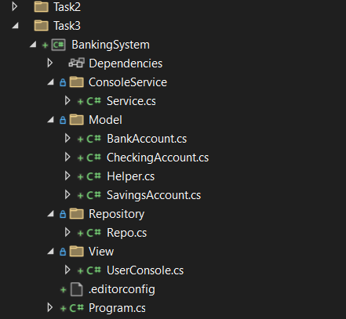

```C#
// ------------------------ Program
namespace Assignments
{
    internal class Program
    {
        static void Main(string[] args)
        {
            Console.WriteLine("Hello, World!");

        }
    }
}
// ------------------------- Repository
using System;
using System.Collections.Generic;
using System.Linq;
using System.Text;
using System.Threading.Tasks;

namespace BankingSystem.Repository
{
    public class Repo
    {
        List<string[]> Accounts = new List<string[]>();

        internal void AddNewAccount((string accountNumber, string accountType) result)
        {
            long balance = 0;
            string[] newAccountDetails =
            {
                result.accountNumber,
                balance,
                result.accountType
            };
            Accounts.Add(newAccountDetails);
        }

        internal List<string> GetAllAccounts()
        {
            return Accounts;
        }
    }
}
// ----------------------------- Helper
using System;
using System.Collections.Generic;
using System.Linq;
using System.Text;
using System.Threading.Tasks;

namespace BankingSystem.Model
{
    internal class Helper
    {
        internal bool IsNumberValid(string? inputAccountNumber)
        {
            if (string.IsNullOrWhiteSpace(inputAccountNumber) || string.IsNullOrEmpty(inputAccountNumber) || !inputAccountNumber.All(char.IsDigit))
            {
                return false;
            }
            else
            {
                return true;
            }
        }

        internal bool IsStringValid(string? inputAccountType)
        {
            if(string.IsNullOrWhiteSpace(inputAccountType) || string.IsNullOrEmpty(inputAccountType))
            {
                return false;
            }
            else if (inputAccountType.ToLower() != "savings" && inputAccountType.ToLower() != "checking")
            {
                return false;
            }
            else
            {
                return true;
            }
        }
    }
}
// ------------------------------------- User Console
using System;
using System.Collections.Generic;
using System.Linq;
using System.Text;
using System.Threading.Tasks;
using BankingSystem.Model;

namespace BankingSystem.View
{
    internal class UserConsole
    {
        Helper helper = new Helper();

        public void menu()
        {
            Console.WriteLine("------Banking System------");
        }

        public (string accountNumber, string accountType) GetAccountDetails()
        {
            Console.Write("Enter account Number:");
            string inputAccountNumber = Console.ReadLine();
            if (!helper.IsNumberValid(inputAccountNumber))
            {
                Console.WriteLine("Invalid account number");
                GetAccountDetails();
            }

            Console.Write("Enter account type [saving/checking]:");
            string inputAccountType = Console.ReadLine();
            if (!helper.IsStringValid(inputAccountType))
            {
                Console.WriteLine("Invalid Account type");
                GetAccountDetails();
            }

            return (inputAccountNumber, inputAccountType);
        }
    }
}
// ---------------------------------------Service
using System;
using System.Collections.Generic;
using System.Linq;
using System.Text;
using System.Threading.Tasks;
using BankingSystem.Repository;
using BankingSystem.View;

namespace BankingSystem.ConsoleService
{
    internal class Service
    {
        UserConsole _userConsole = new UserConsole();
        Repo _repo = new Repo();
        private List<string> _accounts = _repo.GetAllAccounts();

        public void BankingOperation()
        {
            _userConsole.menu();
            var result = _userConsole.GetAccountDetails();
            bool accountStatus = _accounts.Any(array => array.Contains(result.accountNumber));
            if (accountStatus)
            {
                _repo.AddNewAccount(result);
            }
            else
            {
                string[] 
            }
        }
    }
}
// ----------------------------checking account
using System;
using System.Collections.Generic;
using System.Linq;
using System.Text;
using System.Threading.Tasks;

namespace BankingSystem.Model
{
    internal class CheckingAccount
    {

    }
}
// --------------------------savingac
using System;
using System.Collections.Generic;
using System.Linq;
using System.Text;
using System.Threading.Tasks;

namespace BankingSystem.Model
{
    internal class SavingsAccount : BankAccount
    {

    }
}
// ---------------------- BankAccount
using System;
using System.Collections.Generic;
using System.Linq;
using System.Text;
using System.Threading.Tasks;

namespace BankingSystem.Model
{
    internal class BankAccount
    {
        public string AccountNumber { get; set; }

        public decimal Balance { get; set; }

        public void Deposit()
        {

        }

        public void Withdraw()
        {

        }
    }
}
```
